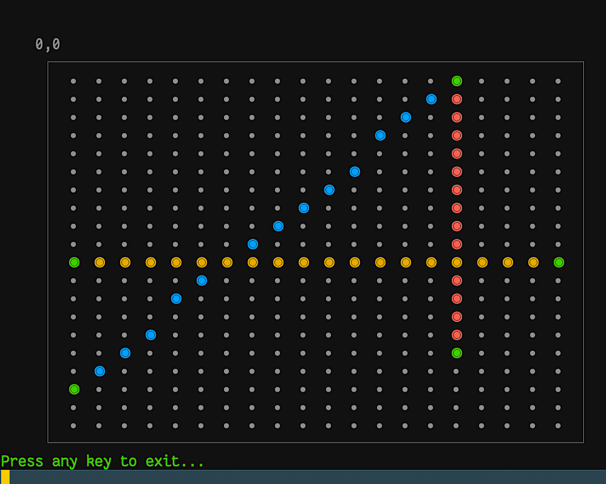

[](https://github.com/kigster/box-with-lines/actions/workflows/main.yml)

# Box & Lines: ASCII Line Drawing Terminal Application

A Ruby terminal application that allows users to draw ASCII art lines on a canvas. The application supports both interactive mode (where users input coordinates manually) and non-interactive mode (where lines are loaded from a JSON configuration file).

> [!NOTE]
> It's important to note that this implementation does not use different ASCII characters to approximate a pixel image, as ASCII art often does. It just computes which squares should be highlighted to show a line of a given slope and start/end.

## Problem Definition

This project provides a terminal-based ASCII art drawing system where users can:

- Draw lines on an ASCII canvas using terminal characters
- Work interactively by entering coordinates
- Load pre-defined line configurations from JSON files
- Render lines with colors and visual effects

The end state is: "user starts the application, they are shown an empty canvas, they are prompted where they want to draw the next line, and the canvas re-renders with the new line."

## Resulting Output

Here an example of running it in the non-interactive mode:

```bash
❯ bin/box-with-lines -c config/config.json
```



> [!TIP]
> Note, that we deliberately mark beginning and end of lines as green dots.

### If you have `direnv` 

You you have direnv setup you can run `direnv allow .` and then you can invoke the executable via `box-with-lines` without the `./bin`.

## The Original Challenge

When this project was first examined, it had **20 failing RSpec tests** covering various aspects of the application. The failing tests indicated issues with:

1. **CLI Help Output** - Help text wasn't being displayed properly
2. **Line Color Defaults** - Lines defaulted to green instead of white
3. **Data Object Implementation** - Point class wasn't using Ruby's Data class for immutability
4. **Argument Mutation** - Input arguments were being modified unexpectedly
5. **Configuration Delegation** - Improper method delegation in the Runner class
6. **Color Rendering** - Board rendering had incorrect color expectations
7. **UI Highlighting** - Color sequences in the user interface were incorrect
8. **Exit Code Handling** - Application exit codes weren't handled properly for testing

## Installation

```bash
# Clone the repository
git clone https://github.com/kigster/box-with-lines
cd box-with-lines

# Install dependencies
bundle install

# Run tests to ensure everything works
bundle exec rspec

# Run rubocop
bundle exec rubocop
```

## Usage

You can run the executable with `-h` or `--help` to see the usage:


```
❯ bin/box-with-lines -h

Usage: box-with-lines [options]
    -c, --config-file FILE           Path to the JSON config file
    -i, --interactive                Interactive mode, ask user for lines.
    -v, --verbose                    Print verbose output
    -h, --help                       Print help
```

The application can run in two modes:

### 1. Interactive Mode

This is the mode where you enter starting and ending coordinates of the line, as a comm-separated pair of integers, like so: "1,19"

```bash
# Start interactive mode where you input coordinates manually
./bin/box-with-lines --interactive

# or with short flag
./bin/box-with-lines -i
```

In interactive mode, you'll be prompted to enter coordinates for line start and end points.

### 2. Configuration File Mode

This is a non-interactive mode where all the lines are defined in the JSON file already.

```bash
# Load lines from a JSON configuration file
./bin/box-with-lines --config-file config/config.json

# or with short flag
./bin/box-with-lines -c config/config.json
```

### 3. Verbose Output

```bash
# Enable verbose output to see detailed information
./bin/box-with-lines --verbose --config-file config/config.json

# or with short flag
./bin/box-with-lines -v -c config/config.json
```

### 4. Help

```bash
# Display help information
./bin/box-with-lines --help

# or
./bin/box-with-lines -h
```

## Configuration Format

The JSON configuration file allows you to define a board and multiple lines with colors:

```json
{
  "board": {
    "width": 20,
    "height": 20,
    "left": 5,
    "top": 5
  },
  "lines": [
    {
      "line": [
        { "x": 15, "y": 15 },
        { "x": 15, "y": 0 }
      ],
      "color": "red"
    },
    {
      "line": [
        { "x": 19, "y": 5 },
        { "x": 10, "y": 0 }
      ],
      "color": "blue"
    },
    {
      "line": [
        { "x": 0, "y": 10 },
        { "x": 19, "y": 10 }
      ],
      "color": "yellow"
    }
  ]
}
```

### Configuration Options

- **board.width**: Width of the drawing canvas (default: 20)
- **board.height**: Height of the drawing canvas (default: 20)  
- **board.left**: Left offset for positioning the board on screen (default: 5)
- **board.top**: Top offset for positioning the board on screen (default: 5)
- **lines**: Array of line definitions
  - **line**: Array of two points `[{x, y}, {x, y}]` defining start and end
  - **color**: Color name (red, blue, yellow, green, white, etc.)

## Features

### Line Types Supported

- **Horizontal lines**: Same Y coordinate for both points
- **Vertical lines**: Same X coordinate for both points  
- **Diagonal lines**: Different X and Y coordinates using line equation

### Visual Features

- **Colored output**: Lines rendered with terminal colors
- **Interactive highlighting**: Visual feedback when placing lines
- **Bordered canvas**: Clean presentation with borders
- **Coordinate validation**: Ensures points are within canvas bounds

### Technical Features

- **Immutable data structures**: Using Ruby's Data class for points
- **Comprehensive validation**: Input validation for coordinates and files
- **Error handling**: Graceful handling of invalid inputs and files
- **Testing**: Complete RSpec test suite with 275+ tests
- **Modular design**: Clean separation of concerns across classes

## Architecture

The application follows a modular design:

- **`Fractional::Ai::Launcher`**: Entry point and command-line interface
- **`Fractional::Ai::CliParser`**: Command-line argument parsing
- **`Fractional::Ai::Runner`**: Application flow control and configuration
- **`Fractional::Ai::Board`**: Canvas management and line rendering
- **`Fractional::Ai::Line`**: Line data structure and calculations
- **`Fractional::Ai::Point`**: Immutable point coordinates
- **`Fractional::Ai::Ui`**: Terminal user interface and interactions
- **`Fractional::Ai::Calc`**: Mathematical utility functions

## Development

### Running Tests

```bash
# Run the full test suite
bundle exec rspec

# Run specific test files
bundle exec rspec spec/fractional/ai/line_spec.rb

# Run with coverage (if configured)
bundle exec rspec --format documentation
```

### Code Quality

The project includes:

- **RuboCop**: Ruby style guide enforcement
- **RSpec**: Comprehensive test coverage
- **Documentation**: Inline code documentation
- **Type checking**: Parameter validation throughout

## Dependencies

- **Ruby**: >= 2.6.0 (tested with 3.4.4)
- **amazing_print**: Pretty printing for debug output
- **colored2**: Terminal color support
- **rspec**: Testing framework
- **rspec-its**: Enhanced testing syntax

## Contributing

1. Fork the repository
2. Create a feature branch (`git checkout -b feature/amazing-feature`)
3. Run tests to ensure they pass (`bundle exec rspec`)
4. Make your changes
5. Add tests for new functionality
6. Ensure all tests pass
7. Commit your changes (`git commit -am 'Add amazing feature'`)
8. Push to the branch (`git push origin feature/amazing-feature`)
9. Create a Pull Request

## License

This project is licensed under the MIT License - see the [LICENSE.txt](LICENSE.txt) file for details.

## Author

**Konstantin Gredeskoul** - [kigster@gmail.com](mailto:kigster@gmail.com)

## Acknowledgments

- Built as part of a Ruby programming exercise
- Demonstrates terminal-based graphics and user interaction
- Showcases test-driven development and debugging practices
